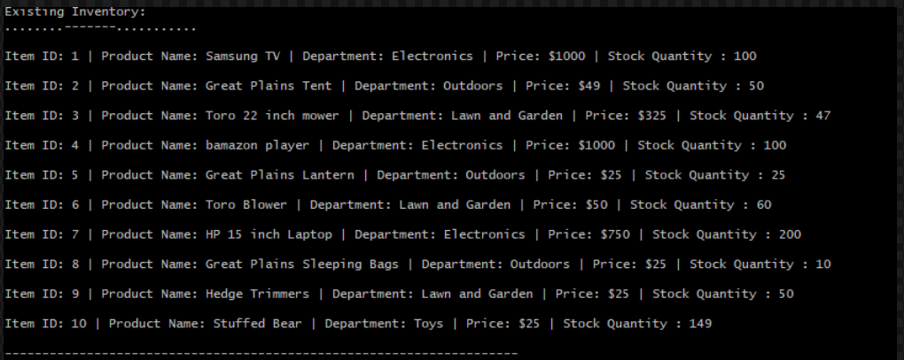
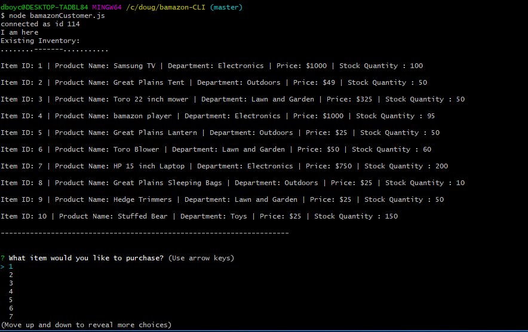
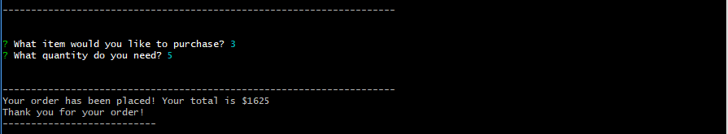
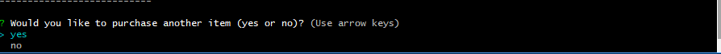

# Bamazon-CLI

# App Description:

Created a backend application using node.js, javascript, and mySQL that stores and can create items for shoppers. 

Individuals can also purchase items using this application from the database (mySQL). 

# Instructions:

* Begin, by cloning this respository. Then copy the items listed in the schema.sql and paste them into the MySQL workbench to establish the database bamazon and the populate the database. Be sure you change the password in the server.js file to the one you use with your mySQL. 

* Next open the terminal or bash terminal. Then type establish the bamazonCustomer.js terminal by typing "node bamazonCustomer.js",  this will then display all items for sale. Then the user can choose what item they want to purchase by selecting item id for a list. After that the user can select how many they want to purchse. If an items is not in stock, a message will display and the customer can select another item from the list.

# Technologies Used: 
	*  Node.js
	*  Javascript
	*  MySQL

## Code Working Examples: 

Since users cannot access MySQL database from GitHub examples of how the application works is presented below.
---
### This is an image of the table that includes all of the items located in the MySQL database seen in the bamazonCustomer.js file.

---
### At the bottom you can see the user inputs for what item they want to select and the quantity of that item as seen in the bamazonCustomer.js file.

---
### Now you can see how many items were selected and the total cost of the amount of item. 

---
### The user is offered the option to select another item or exit the appllication.

